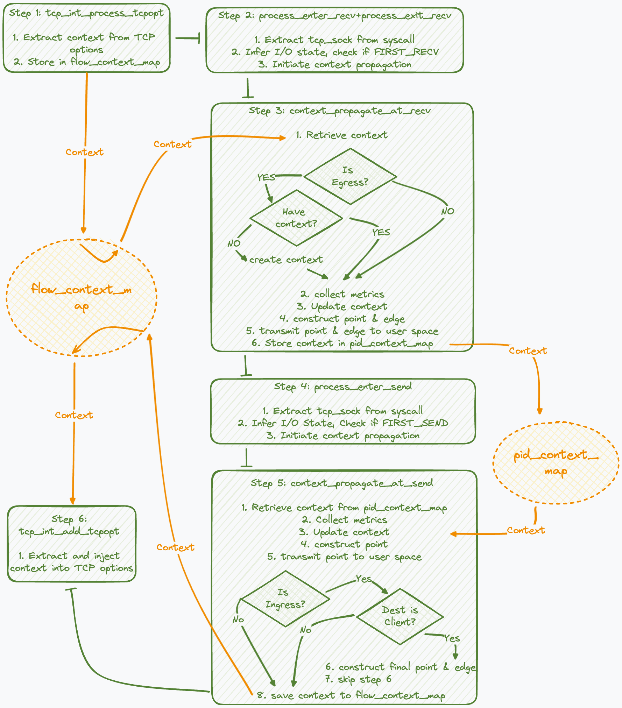

# Gearbox Context Propagation Workflow

This document provides a comprehensive guide to the processes and mechanisms employed by Gearbox to ensure seamless context propagation across network transactions. 

## Overview

Gearbox utilizes advanced monitoring and tracing techniques to maintain and manage the state of network communications efficiently, leveraging eBPF technology to intercept and manipulate network packets at the kernel level. 

Please follow through the workflow sections below to grasp how each part of the process integrates.

## Workflow

The workflow described herein details step-by-step how Gearbox parses TCP options, handles system calls, and propagates context through various network components to achieve precise and reliable data tracking. The included diagram (see below) illustrates the overall workflow, aiding in the visual understanding of the context propagation mechanisms.

### Step 1: Parsing TCP Options

- **Function**: `tcp_int_process_tcpopt`
- **Operations**:
  1. Check and parse the TCP options in the TCP packet.
  2. Extract previously injected context information.
  3. Store the context information in the `flow_context_map` based on the flow-tuple.

### Step 2: Handling Receive System Calls

- **Functions**: `process_enter_recv` and `process_exit_recv`
- **Operations**:
  1. Extract `struct tcp_sock` from system call parameters.
  2. Determine if the previous system call was of the send type; if so, this indicates that this is the first in a sequence of receive-type system calls.
  3. If it is the FIRST_RECV, initiate context propagation.

### Step 3: Context Propagation at Receive
- **Function**: `context_propagate_at_recv`
- **Operations**:
  1. For regular components, retrieve previously saved context information from the `flow_context_map` based on the flow-tuple.
  2. Collect performance metrics.
  3. Update context information (e.g., update invoke ID), and construct `struct point` and `struct edge` based on the invoke ID, then transmit them to the user space through the ring buffer.
  4. Store the context in the `pid_context_map`.
  5. For ingress components, if there is no existing context, create a new context, and record the peer IP address as the client IP in `client_ip_map`.

### Step 4: Handling Send System Calls

- **Function**: `process_enter_send`
- **Operations**:
  1. Extract `struct tcp_sock` from system call parameters.
  2. Determine if the previous system call was of the receive type; if so, this indicates that this is the first in a sequence of send-type system calls.
  3. If it is the FIRST_SEND, initiate context propagation.

### Step 5: Context Propagation at Send

- **Function**: `context_propagate_at_send`
- **Operations**:
  1. For regular components, retrieve previously saved context information from the `pid_context_map` based on the flow-tuple.
  2. Collect performance metrics.
  3. Update context information (e.g., update invoke ID), and construct `struct point` based on the invoke ID, then transmit it to the user space through the ring buffer.
  4. Store the context in the `flow_context_map` based on the flow-tuple.
  5. For ingress components, if the destination address matches the client's flow-tuple, construct a `struct point` representing the client and the final `struct edge`, and transmit them through the ring buffer, skipping Step 6.

### Step 6: Injecting TCP Options

- **Function**: `tcp_int_add_tcpopt`
- **Operations**:
  1. Extract context based on the flow-tuple.
  2. Inject the context information into the TCP options.
